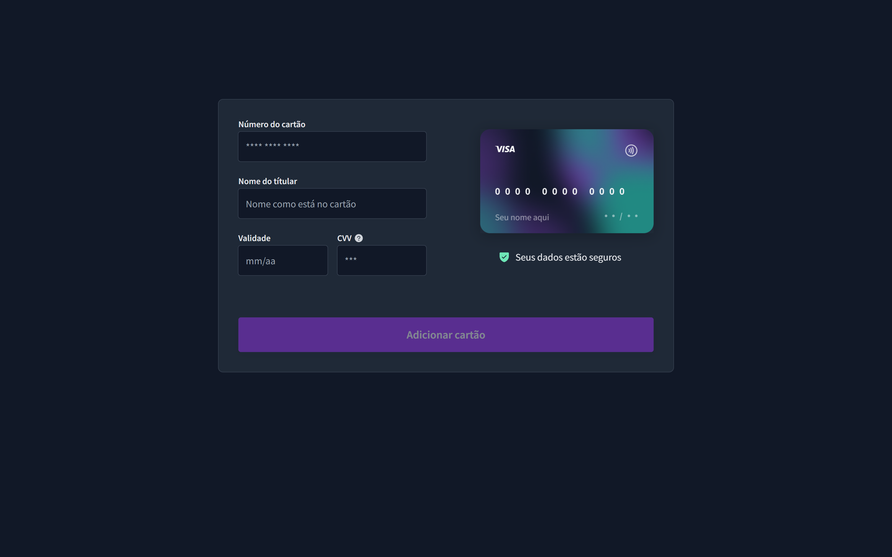

  

# Credit Card Form 💳

## 💡 Sobre o Projeto:
   

  Aplicação de um formulário de cartão de crédito interativo desenvolvido para aprimorar skills de CSS puro.
   
  
  O formulário do Cartão de Crédito contém funcionalidades como o preenchimento das informações nos campos de input que são repassadas para o layout do cartão e o flip no para a parte de trás quando o focus está no input do CVV, e que volta para a parte da frente do cartão quando o focus está nos outros campos.
    

#   

## 🧰 Setup do Projeto:

- HTML
- CSS
- Git | Github
- Figma

#

## 📌 Resultado do Projeto:
 

## 🎨 Inspiração

Projeto construído a partir do layout proposto no desafio [#BoraCodar13](https://boracodar.dev/) realizado pela [Rocketseat](https://rocketseat.com.br).
